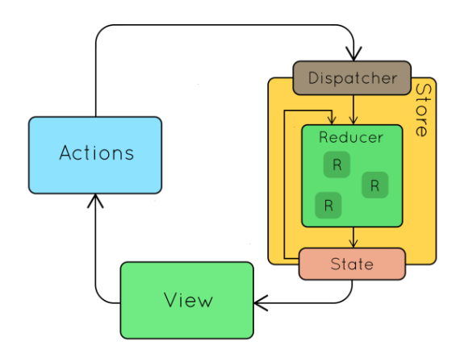

### Mục tiêu bài học React-native

- Hiểu được các thành phần cơ bản của React-Native.
- Nắm vững được vòng đời của một màn hình, component của React-Native.
- Tùy biến các component theo ý muốn.
- Tìm kiếm, sử dụng và tùy biến thư viện.
- Xây dựng 1 ứng dụng đọc báo như báo mới.

### Hướng dẫn cài đặt môi trường react-native trên hệ điều hành Windows.

- Tài liệu tham khảo: https://reactnative.dev/docs/environment-setup
- Step 1: Cài đặt Android Studio
    - Điều kiện: Cần cài JDK 8    
    - Để build máy ảo Android (Android emulator)
    - Cài đặt SDK Platform
- Step 2: Khởi động máy ảo Android emulator
- Step 3: Cài đặt expo

```angular2html
npm install -g expo-cli
```

- Step 4: Init dự án React native đầu tiên

```angular2html
expo init ReactNativeDemoProject

Nếu dùng git bash

expo init ReactNativeDemoProject --template blank
```

- Step 5: Chạy ứng dụng React native vừa tạo

```angular2html
To run your project, navigate to the directory and run one of the following yarn commands.

- cd ReactNativeDemoProject
- yarn start # you can open iOS, Android, or web from here, or run them directly with the commands below.
- yarn android
- yarn ios # requires an iOS device or macOS for access to an iOS simulator
- yarn web

```

- Step 6: Check expo build tool trên web

```angular2html
http://localhost:19002/
```


- Step 7: Kiểm tra hiển thị giao diện ứng dụng trên Android Emulator


Hiển thị giao diện như vậy là đã cài đặt dự án React native đầu tiên thành công.

- Step 8: Reload lại ứng dụng trên Android Emulator 
  - MẶc định ứng dụng sẽ được hot reload khi sửa đổi nội dung của file
  - Trong nhiều trường hợp không reload: Nhấn phím R 2 lần nhanh để reload APP


### Chạy project trên máy Android thật

- Lên CH play cài ứng dụng Expo
- Quét QR code hiển thị trong command hoặc trên http:localhost:19002

Mở link expo tương ứng đã quét để chạy app


### Các thành phần cơ bản của dự án

- **Thư mục node_modules**: chứa toàn bộ các package (thư viện) cần để chạy một ứng dụng react-native.

- **File package.js**: file quản lý các package nodejs đi kèm với dự án. Nếu bạn tải các dự án demo về cần dử dụng dòng lệnh ```npm install``` để tải toàn bộ thư viện yêu cầu của dự án về.

- **File package-lock.js** file được general sau khi chạy cài đặt ```npm install```

- **File index.js**: file đầu tiên được binding khi chạy ứng dụng. File này sẽ đăng ký một component, component này sẽ được load lên đầu tiên khi chạy, mặc định ứng dụng sẽ đăng ký component trong App.js

- **File app.json**: file config tên ứng dụng và tên hiển thị.

- **File App.js** là một component mặc định có sử dụng một số Component khác như Text, View...

### Cách debug trong React native

- Sử dụng console.log
- Theo dõi log trong cmd


### Tạo ứng dụng đọc báo đơn giản


- Các thư viện cài thêm
```angular2html
"native-base": "^2.12.1",
"react-native-webview": "^11.14.1"
"moment": "^2.29.1",
```

### Tài liệu tham khảo

- https://reactnative.dev/docs/environment-setup
- https://docs.nativebase.io/default-theme
